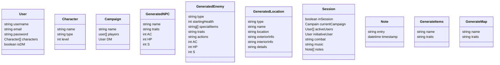

# README
*  ruby bin/rails server

erdiagram 12/16/2023

```mermaid
classDiagram
User : string username
User : string email
User : string password
Character : string name
Character : string type
Character : int level
User : Character[] characters
User : boolean isDM
Campaign : string name
Campaign : user[] players
Campaign : User DM
GeneratedNPC : string name
GeneratedNPC : string traits
GeneratedNPC : int AC
GeneratedNPC : int HP
GeneratedNPC : int S
GeneratedEnemy : string type
GeneratedEnemy : int startingHealth
GeneratedEnemy : string[] specialItems
GeneratedEnemy : string traits
GeneratedEnemy : string actions
GeneratedEnemy : int AC
GeneratedEnemy : int HP
GeneratedEnemy : int S
GeneratedLocation : string type
GeneratedLocation : string name
GeneratedLocation : string location
GeneratedLocation : string exteriorInfo
GeneratedLocation : string interiorInfo
GeneratedLocation : string details
Session : boolean inSession
Session : Campain currentCampaign
Session : User[] activeUsers
Session : User initiativeUser
Session : string combat
Session : string music
Session : Note[] notes
Note : string entry
Note : datetime timestamp
GenerateItems : string name
GenerateItems : string traits
GenerateMap : string name
GenerateMap : string traits
```
